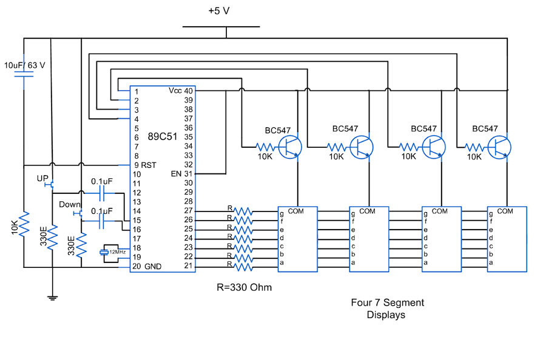

### (a) To Implement an Up/Down Counter Using Two General Purpose I/O Pins as Control Inputs.

#### **Introduction**
An Up/Down Counter is a digital circuit that counts numbers either in increasing (up) or decreasing (down) order based on a control signal. This experiment demonstrates a single-digit up/down counter implemented using the 89C51 microcontroller. Two general-purpose I/O pins are configured as control inputs for incrementing or decrementing the count. The current count is displayed on a single 7-segment display with a counting range of 0–9.

#### **Working Principle**
The microcontroller continuously monitors two push buttons connected to its GPIO pins. Pressing the UP button increments the count by one, while pressing the DOWN button decrements the count by one. These buttons are connected through pull-up resistors and debouncing capacitors to ensure stable input signals. The count value is stored in memory and ranges from 0 to 9. When the upper or lower limit is reached, the counter rolls over automatically, ensuring continuous operation.

#### **Sample Circuit Diagram**

  
  
<b>Fig. 1 Sample Circuit Diagram of Up/Down Counter using 8051</b>

#### **Role of GPIO Pins**
Two pins of Port 3 are configured as control inputs to read the UP and DOWN commands. Other pins of Port 2 output the segment patterns (**a–g**) to drive the single 7-segment display through current-limiting resistors, ensuring correct illumination of each segment.

#### **8051 Microcontroller Features Used**
The project utilizes the general-purpose I/O (GPIO) pins of the 89C51 microcontroller for both input and output operations. An efficient polling loop is implemented to continuously monitor button presses, and the segment patterns are sent directly to the display.

#### **Software Logic**
The program begins by initializing the counter to 0 and configuring the required GPIO pins. The UP and DOWN input pins are polled continuously in the main loop. Whenever a button press is detected, the counter value is updated accordingly. The updated value is then converted to the corresponding 7-segment pattern and sent to Port 2 to display it. Small delays are added to handle switch debouncing.

#### **Counting Range**
Since only a single digit is used, the counter can display values from 0 to 9. When counting upwards from 9, the counter rolls over to 0. Similarly, when counting down from 0, it rolls back to 9. This ensures continuous cyclic counting in both directions.

#### **Applications**
The single-digit up/down counter has applications in educational experiments, small digital counters, and as a basic demonstration of microcontroller I/O and 7-segment display interfacing. Its simplicity makes it ideal for learning purposes.

### (b) To Implement an Up/Down Counter Using One Interrupt Pin as a Control Pin.

An Up/Down Counter is a digital circuit that counts numbers either in increasing (up) or decreasing (down) order based on a control signal. In this experiment, we use one external interrupt pin (INT0) of the 8051 microcontroller to toggle the counting direction. The counter is implemented on a single 7-segment display that shows digits from 0 to 9. Since only one display is used, the counter is limited to one decimal digit.

#### **Working Principle**

The counter begins operation in the UP mode, where it counts sequentially from 0 up to 9. When the INT0 interrupt is triggered, the counting direction reverses and the counter starts counting in the DOWN mode from 9 back to 0. This switching mechanism allows the counter to alternate between upward and downward counting depending on the external interrupt signal.

#### **Applications**

Even though this counter is limited to a single digit (0–9), it can still demonstrate practical applications such as event counters, simple timers, and scoreboards. In real-world systems, this principle is extended to multi-digit counters used in digital clocks, frequency counters, and stepper motor control.

#### **8051 Features Used**

The Port P1 pins are used to output data to the 7-segment display, driving the individual segments. The INT0 pin (P3.2) serves as the external interrupt input, allowing the user to switch between up and down counting modes.

#### **External Interrupt (INT0)**

The INT0 pin of the 8051 is located at P3.2 (Pin 12). In this experiment, it is configured as an edge-triggered interrupt that responds to the falling edge of the input signal, achieved by setting `IT0 = 1`. When the interrupt is activated, the CPU jumps to the fixed memory location `0003H`, where the Interrupt Service Routine (ISR) is stored. The ISR toggles the counting direction by changing a flag variable and concludes with the `RETI` instruction, which returns control back to the main program.

#### **Control Logic**

The control of the counter is governed by a simple logic involving a **DIR** variable. When **DIR = 1**, the counter runs in the UP mode (0 → 9). When **DIR = 0**, the counter runs in the DOWN mode (9 → 0). Each time the **INT0** interrupt is triggered, this variable is inverted, thereby switching the counting direction.
